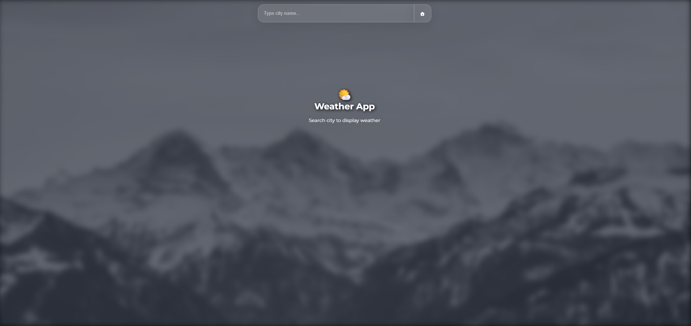
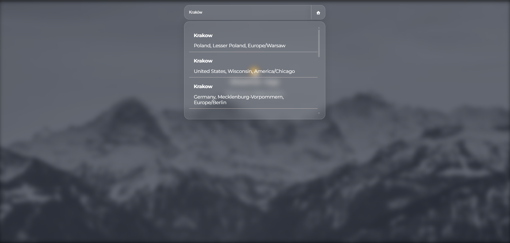
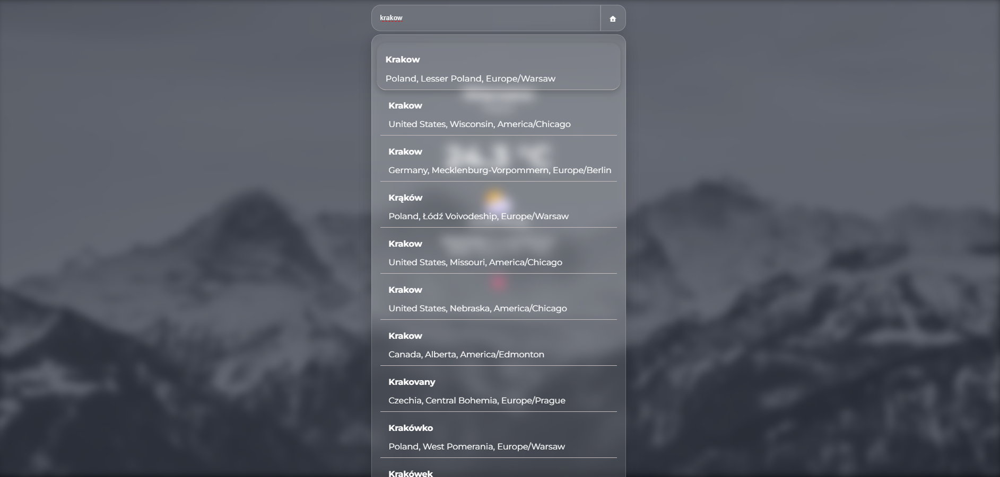
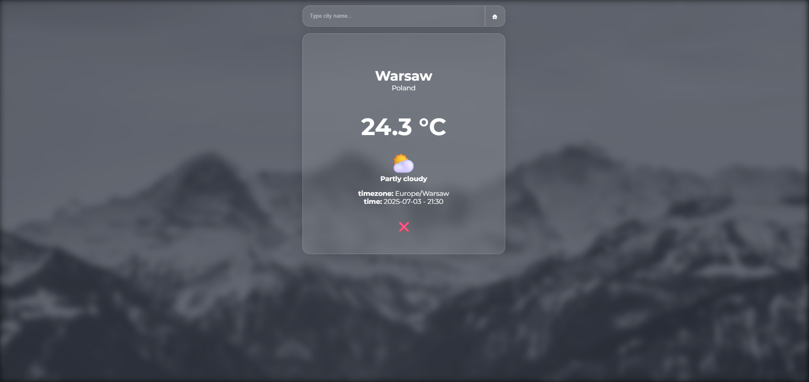

# 🌤️ Weather App

A minimalist weather app built with React, using the Open-Meteo API and browser geolocation. It allows users to search for cities, view current weather, and get weather for their current location.

> [!WARNING]
> This project was developed personally as a learning exercise and an experiment with React and API integration. It is not intended for everyday use and is not deployed or hosted publicly.

## Table of Contents

1. [Features](#features)
2. [Tech Stack](#tech-stack)
3. [Screenshots](#screenshots)
4. [How to run](#how-to-run)

## Features

- 🔍 City search with suggestions.
- 📍 "Use my location" via browser geolocation.
- 🌡️ Current temperature and weather.
- 🕒 Displays timezone and local time.
- 💾 Saves selected location to localStorage.
- ⚠️ Error handling and empty results support.
- ✨ Simple and clean UI.
- 🧠 Intuitive UX (keypress shortcuts, hover tooltips, graceful loading and fetch handling).

## Tech Stack

- React 
- Open-Meteo API 

- HTML5 
- CSS

## Screenshots

### Start Page



### Search




### Weather



## How to run

```bash
https://github.com/KucielKrzysztof/Weather-App.git
cd weather-app
npm i
npm run dev
```
