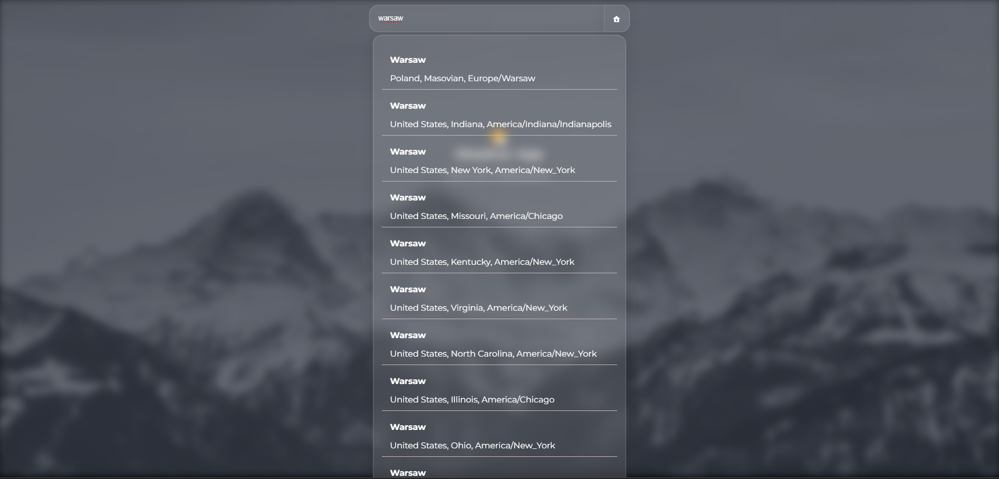

# 🌤️ Weather App

A minimalist weather app built with React, using the Open-Meteo API and browser geolocation. It allows users to search for cities, view current weather, and get weather for their current location.

> [!WARNING]
> This project was developed personally as a learning exercise and an experiment with React and API integration. It is not intended for everyday use.

## Table of Contents

1. [Features](#features)
2. [Architecture Highlights](#architecture-highlights)
3. [Tech Stack](#tech-stack)
4. [Screenshots](#screenshots)
5. [How to run](#how-to-run)

## Features

- 🔍 City search with suggestions.
- 📍 "Use my location" via browser geolocation.
- 🌡️ Detailed Weather Display: Current temperature, weather conditions, wind speed, humidity, and pressure.
- 📅 7-Day Forecast: Displays maximum and minimum temperatures for the upcoming week.
- 💾 Saves selected location to localStorage.
- ⚠️ Error handling and loading states (with custom CSS spinner)
- ✨ Simple and clean UI.
- 🧠 Intuitive UX (keypress shortcuts, graceful loading and fetch handling).

## Tech Stack

| Category        | Technologies                                                                                                                                                                                                                                                                                                                                                                                          |
| :-------------- | :---------------------------------------------------------------------------------------------------------------------------------------------------------------------------------------------------------------------------------------------------------------------------------------------------------------------------------------------------------------------------------------------------- |
| **Frontend**    |     |
| **State/Cache** |                                                                                                                                                                                                                                                                            |
| **API**         |                                                                                                                                                                                                                                                                      |
| **Styling**     | Glassmorphism, Responsive Design, Custom Scrollbars                                                                                                                                                                                                                                                                                                                                                   |

## Screenshots

### Start Page


### Search



### Weather


## How to run

```bash
https://github.com/KucielKrzysztof/Weather-App.git
cd weather-app
npm i
npm run dev
```
